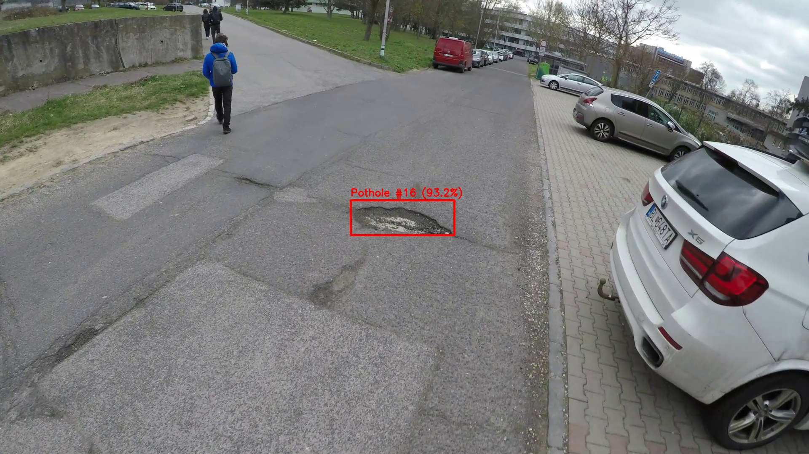

# Bachelor Thesis: Application of Artificial Intelligence in the Digital Transformation of Public Administration Processes

**Student:** Daniel Kotuláč
**Supervisor:** PhDr. Ing. Tomáš Gál, PhD. 
**Contanct:** [kotulac1@uniba.sk](mailto:kotulac1@uniba.sk) | [GitHub](https://github.com/dakotsvk/Bakalarska-Praca)

---

## Thesis Assignment

**Anotations:** This bachelor thesis investigates the potential of applying existing or emerging artificial intelligence techniques in the digital transformation of processes within state and public administration — it identifies concrete domains (registries, workflow systems, decision-making processes, verification automation, etc.) where AI could substantially lower transaction costs, streamline operations, and enhance service quality. The thesis also examines the obstacles to implementing these solutions (legal, ethical, technical), evaluates associated risks, and proposes strategies for optimal deployment in the Slovak public sector, drawing on current critiques of the state IT “underpinnings” and digitalization process shortcomings.
**Aim of the Thesis:** The aim of the thesis is to identify and analyze opportunities for applying artificial intelligence in the digital transformation of public administration processes, with an emphasis on reducing transaction costs and improving service efficiency.

---

## Abstract
This bachelor's thesis focuses on the design, training, and implementation of an automated software system for detecting and mapping road surface degradation using artificial intelligence. The primary objective is to provide a cost-effective alternative to subjective manual reporting and expensive LiDAR surveys by utilizing consumer-grade action cameras mounted on municipal vehicles. The core visual recognition is powered by a custom-trained YOLO26 object detection model, trained on a curated dataset of 1,369 images. To anchor these digital detections to the physical world, a custom Python pipeline was developed. This software features automated batch processing, peak-confidence deduplication logic, and a nearest-neighbor temporal synchronization algorithm that accurately pairs video frames with high-frequency GPS telemetry. 

Quantitative evaluation of the model yielded a mean Average Precision (mAP@0.5) of 0.841 and a peak F1-score of 0.79. Subsequent real-world testing demonstrated the pipeline's capability to process continuous video footage and automatically output an interactive geospatial HTML map of the detected road defects. These findings indicate that the proposed architecture serves as a viable proof of concept, providing a functional baseline for data-driven road infrastructure management in municipal applications.

## System Outputs & Live Examples

The automated Python pipeline translates raw video footage and telemetry into actionable administrative tools. It generates a structured CSV database, annotated visual evidence, and an interactive geospatial map. Below are examples generated from our real-world continuous driving tests.

### 1. Annotated Evidence Imagery
When the YOLO26 model tracks a pothole across multiple video frames, it isolates the single frame with the absolute highest prediction confidence. The system automatically saves this frame as visual proof, overlaying the bounding box and certainty percentage before dispatching a repair crew.

  
   
  <em>Example of YOLO26 isolating and classifying a physical road defect at peak confidence.</em>

### 2. Interactive Geospatial Map
The extracted video timestamps are mathematically synchronized with high-frequency GPS telemetry to map the physical locations of the detected defects. 

**Click the image below to explore the live, interactive map of all detected road defects:**

  

## Resources & Bibliography

### Core AI & Machine Learning
* **[Ultralytics YOLO26](https://github.com/ultralytics/ultralytics):** The core object detection architecture used for this project.
* **[PyTorch](https://pytorch.org/):** The underlying deep learning framework that powered the YOLO26 model training and tensor matrix calculations.

### Data & Annotation
* **[Roboflow](https://roboflow.com/):** Used to source the initial, open-source baseline dataset of 1,243 annotated pothole images.

### Data Processing & Visualization Libraries
* **[OpenCV (cv2)](https://opencv.org/):** Utilized heavily in the inference script to decode the raw video files frame-by-frame, and to draw the bounding boxes and confidence scores onto the final evidence imagery.
* **[Pandas](https://pandas.pydata.org/):** Handled the ingestion and structuring of the extracted GPS telemetry.
* **[Folium](https://python-visualization.github.io/folium/):** Used to generate the final interactive geospatial HTML map.

###Bibliography & References

1. **Straub, V. J., Morgan, D., Bright, J., & Margetts, H.** (2023). "Artificial intelligence in government: Concepts, standards, and a unified framework." *Government Information Quarterly*, 40(4), 101881.
2. **Van Noordt, C., & Tangi, L.** (2023). "The dynamics of AI capability and its influence on public value creation of AI within public administration." *Government Information Quarterly*, 40(4), 101860.
3. **Alhosani, K., & Alhashmi, S. M.** (2024). "Opportunities, challenges, and benefits of AI innovation in government services: a review." *Discover Artificial Intelligence*, 4(1), 18.
4. **Hjaltalin, I. T., & Sigurdarson, H. T.** (2024). "The strategic use of AI in the public sector: A public values analysis of national AI strategies." *Government Information Quarterly*, 41(1), 101914.
5. **City of Amsterdam.** (2020). "Object detection kit amsterdam automatic detection of garbage." *Interoperable Europe Portal, European Commission*.
6. **Bastani, H., et al.** (2021). "Efficient and targeted COVID-19 border testing via reinforcement learning." *Nature*, 599(7883), 108-113.
7. **Yigitcanlar, T., et al.** (2023). "Artificial intelligence in local government services: Public perceptions from Australia and Hong Kong." *Government Information Quarterly*, 40(3), 101833.
8. **LeCun, Y., Bengio, Y., & Hinton, G.** (2015). "Deep learning." *Nature*, 521(7553), 436-444.
9. **Redmon, J., et al.** (2016). "You only look once: Unified, real-time object detection." *Proceedings of the IEEE conference on computer vision and pattern recognition*.
10. **Křemen, T., et al.** (2024). "Optimizing mobile laser scanning accuracy for urban applications: A comparison by strategy of different measured ground points." *Applied Sciences*, 14(8), 3387.
11. **Ultralytics.** (2026). "YOLO26 Official Documentation and Architecture."

### Week 1: Environment Setup
- Initial consultation with the supervisor.
- Initial literature review on AI applications in the public sector.

### Week 2:
- Further theory review
- Made decisions on which tools to use
- Made a website and github repository for the thesis.

### Week 3:
- Dowloaded a training dataset
- Installed and trained AI model
- Tested AI model on manually colected data
- Review on how to improve the accuracy of detection further
  
### Week 4:
- Further AI training on my own data
- Basic script to detect potholes and log their gps coordinates to an interactive map from photos
- Further data collection

### Week 5:
- Further AI training
- Made script to detect and log potholes and their gps locations
- Further data collection
  
### Week 6:
- Fixed Errors in script
- Retrained AI model from scratch

### Week 7:
- Meeting with supervisor about progress
- Finished coding part of thesis
  
### Weeks 8-16:
- Writing of the text part of the thesis
- Consultation with supervisor about the text part of the thesis

